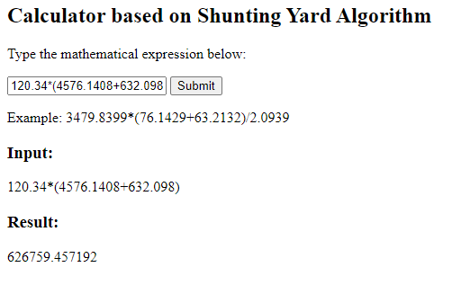

# Summary
A web-based calculator based on Shunting Yard Algorithm

# Files/Directories
- input.html : main page
- algo.js : script containing all javascript functions

# References:
- https://brilliant.org/wiki/shunting-yard-algorithm/
- https://www.javascripttutorial.net/javascript-dom/javascript-createelement/
- https://www.martinbroadhurst.com/shunting-yard-algorithm-in-python

